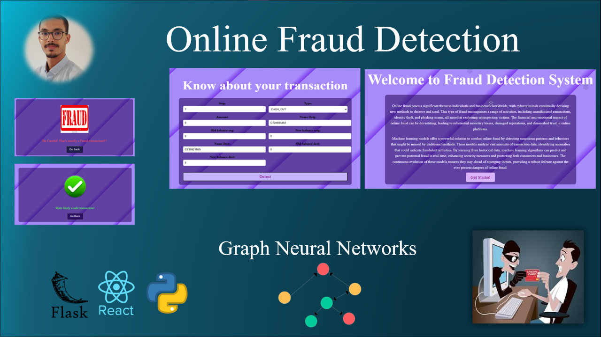
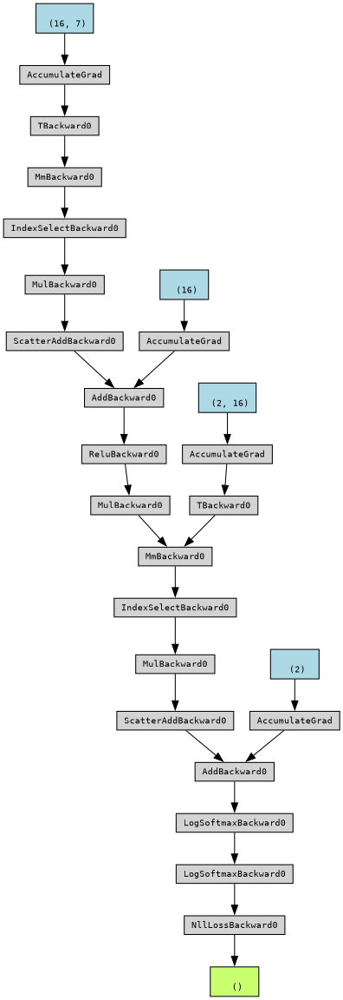

<div align="center">
  
  <h1 style='color:#4c4893' align='center'>
    Online Fraud Detection Project using GNN (Graph Neural Network)
  </h1>


  
</div>

### About the dataset
<div style="background-color:white; color:black; font-size:15px; font-family:Comic Sans MS; padding:10px; border: 5px solid black;font-weight:bold;border-radius: 20px;">
    In order to build the model we used the dataset issued from this link <br>
    <a href='https://www.kaggle.com/datasets/jainilcoder/online-payment-fraud-detection'>https://www.kaggle.com/datasets/jainilcoder/online-payment-fraud-detection</a><br>
    Below are all the columns from the dataset I’m using here:
<ul>
  <li>step: represents a unit of time where 1 step equals 1 hour</li>
  <li>type: type of online transaction</li>
  <li>amount: the amount of the transaction</li>
  <li>nameOrig: customer starting the transaction</li>
  <li>oldbalanceOrg: balance before the transaction</li>
  <li>newbalanceOrig: balance after the transaction</li>
  <li>nameDest: recipient of the transaction</li>
  <li>oldbalanceDest: initial balance of recipient before the transaction</li>
  <li>newbalanceDest: the new balance of recipient after the transaction</li>
  <li>isFraud: fraud transaction</li>
</ul>

</div>

### About the project
As you can note the directory contains three folders :
* model-building : this folder contains the notebook where we conducted our EDA analysis and trained our model accompagned with the dataset used and the stocked model with it's metadata.

* back-end : this folder contains the code of building our Flask Api that will generate the predictions while the user filling the form in the fron-end

* front-end : this folder contains the front-end code with react js and tailwind css for the application used to deploy our created model. 

### How to run it
First You should run the backend and to do that you will go to the terminal , redirect to the back-end directory,
activate the virtual environnement then start the flask api.

```bash
cd back-end
conda activate backvenv
python back.py
``` 
note that you can test the api with curl with :
```bash
curl -X POST http://127.0.0.1:5000/predict -H "Content-Type: application/json" -d "{\"transactions\": [{\"step\": 1, \"type\": \"PAYMENT\", \"amount\": 100.0, \"nameOrig\": \"C728984460\", \"oldbalanceOrg\": 4953893.08, \"newbalanceOrig\": 4953893.08, \"nameDest\": \"C639921569\", \"oldbalanceDest\": 0.0, \"newbalanceDest\": 100.0}]}"
```
Then open another terminal  where you launch the frontend with 

```bash
cd front-end\fraud-detection-app
npm start
``` 
then go to the localhost:3000 and try it !!


here is the models architecture:



<div style="background-color:#4c4893; color:white; font-size:15px; font-family:Comic Sans MS; padding:10px; border: 5px solid black;font-weight:bold;border-radius: 20px;text-align:center"> ✨ THE END ✨</div><br>
