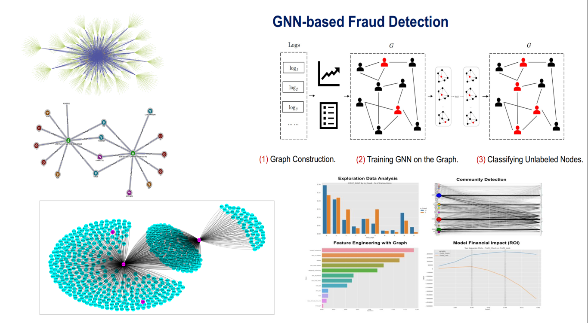

# Advanced Fraud Detection with Graph

This repository contains advanced techniques for fraud detection using graph-based methods. It leverages Graph Neural Networks (GNN) and graph-based features to improve fraud detection performance, reducing false positives and enhancing model explainability.

## Notebooks

### 1. Explainable Fraud Detection with Graph

- **Objective**: Develop an explainable fraud detection system using Graph Neural Networks (GNN). The notebook focuses on creating interpretable models that can identify fraudulent transactions while providing insights into the decision-making process.
- **Key Features**:
  - Integration of GNN to capture complex transaction patterns.
  - Explainability techniques to understand model predictions.
  - Evaluation of model performance with metrics such as MCC and AUC.

### 2. Fraud Detection with Graph Features

- **Objective**: Enhance fraud detection models by incorporating graph-based features derived from transaction data. This notebook explores the use of network analysis to extract meaningful features that can improve model accuracy.
- **Key Features**:
  - Extraction of graph-based features such as centrality measures, clustering coefficients, and community detection.
  - Integration with traditional machine learning models.
  - Comparison of model performance with and without graph features.
